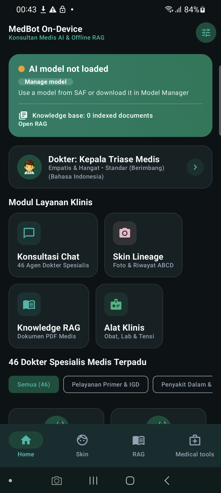

# MedBot

MedBot adalah aplikasi Android Kotlin + Jetpack Compose untuk decision support kesehatan yang local-first. UI, triase, persona, kalkulator deterministik, penyimpanan chat, parser dokumen, dan orkestrasi RAG berjalan di perangkat. Model AI hanya boleh berjalan setelah runtime LiteRT-LM memvalidasi berkas `.litertlm` nyata, ukuran, checksum SHA-256, backend, dan inisialisasi engine.

MedBot tidak mengimplementasikan auth, Hindi, cloud AI, telemetry medis, diagnosis otomatis, atau klaim perlindungan klinis. Tidak ada model, dokumen klinis sintetis, foto contoh, atau output fabricated di production source.

## Status acceptance

Status di bawah memisahkan bukti source/build dari acceptance runtime. `PASS` pada test bukan bukti bahwa model atau hasil klinis telah tervalidasi.

| Area | Status | Batas bukti |
| --- | --- | --- |
| Kotlin, Compose, Material 3, MVVM/UDF, Hilt | PASS (source/build) | Dependency graph dan compile berhasil; device visual tetap diverifikasi terpisah. |
| Home, Chat, Skin, Knowledge Base, Models, Persona, Medical Tools | PARTIAL PASS | Source/state/navigation paths pass; Samsung API 33 smoke captures show the real empty, unavailable, and model-gated states. Full clinical/model journey remains blocked by missing real inputs. |
| Bahasa Indonesia dan English | PASS (source) | Resource string tersedia; Hindi tidak termasuk scope. |
| Triase dan registry 46 agent | PASS (unit) | Registry/policy test berjalan; LLM inference tetap memerlukan model nyata. |
| Calculator dengan input klinis eksplisit | PASS (unit/source) | Blank, malformed, dan out-of-range ditolak; tidak ada default umur/berat/tinggi/tanggal/lab/obat. |
| Lint debug | PASS | `:app:lintDebug --rerun-tasks` berhasil pada 2026-08-19. |
| Unit test | PASS | `:app:testDebugUnitTest --rerun-tasks`: 44 test, 1 skipped, berhasil pada 2026-08-19. |
| Debug APK | PASS | `:app:assembleDebug --rerun-tasks` berhasil pada 2026-08-19. |
| LiteRT-LM model load/inference | BLOCKED | Tidak ada bundle `.litertlm` resmi dengan metadata URL/ukuran/SHA-256 terverifikasi; registry sengaja kosong. UI menampilkan `MODEL_UNAVAILABLE`. |
| RAG dokumen nyata | BLOCKED | TXT/MD/PDF/DOCX parser dan provenance component tersedia; belum ada dokumen user nyata dan embedder lokal yang tervalidasi. UI menampilkan `EMBEDDER_UNAVAILABLE`. |
| Skin vision | UNAVAILABLE | Tidak ada vision model lokal yang diinisialisasi; gambar invalid/permission gagal tidak menghasilkan diagnosis atau baseline benign. |
| Drug/lab reference catalog | UNAVAILABLE | Seeder sintetis dihapus; katalog hanya dapat digunakan setelah sumber terverifikasi dimuat. |
| Instrumentation/device E2E | PARTIAL PASS | `connectedDebugAndroidTest` pass pada Samsung API 33 untuk evidence-gated unavailable state; Xiaomi tidak terdeteksi. Model/RAG/vision journey tetap BLOCKED. |

Traceability lengkap ada di [docs/traceability.md](docs/traceability.md). Journey evidence-gated ada di [docs/e2e/journeys/medbot_evidence_gate.xml](docs/e2e/journeys/medbot_evidence_gate.xml).

## Arsitektur

```text
Compose UI (stateless, lifecycle-aware)
        -> ViewModel + StateFlow / sealed UI event
        -> use case / domain policy (pure Kotlin)
        -> repository / gateway interface
        -> Room, DataStore, SAF, LiteRT-LM, platform adapter
```

Package utama:

- `domain/`: model, triage, agent registry, calculator, policy, dan interface gateway.
- `data/`: Room/DataStore repository, real parser, downloader, LiteRT-LM adapter, dan fail-closed adapters.
- `presentation/`: ViewModel, screen state, navigation, dan Compose content.
- `core/`: Hilt composition root, Material 3 design system, localization, dan shared UI components.

`ViewModel` tidak menyimpan `Activity`/`View`, Compose tidak memanggil service Android langsung, dan domain tidak mengimpor implementasi data. Room menggunakan migration eksplisit; destructive migration tidak dipakai. Backup mengecualikan chat, foto kulit, dokumen RAG, model, database, dan preference sensitif.

## Local-only dan evidence gate

Tidak ada request cloud AI atau upload data medis. Downloader model hanya menerima HTTPS manifest yang memiliki metadata integritas lengkap. Karena belum ada manifest resmi yang dapat diverifikasi di checkout ini, `ModelRegistry.OFFICIAL_MODELS` tetap kosong. Menambahkan URL, ukuran, checksum, dokumen Kemenkes, embedding, atau output klinis buatan akan melanggar kontrak project.

Input yang tidak tersedia menghasilkan state eksplisit: `MODEL_UNAVAILABLE`, `EMBEDDER_UNAVAILABLE`, `INSUFFICIENT_DATA`, atau `UNAVAILABLE`. Aplikasi tidak mengubah keadaan tersebut menjadi jawaban canned, vector hash, pseudo-page, hasil kulit benign, atau diagnosis.

## Build dan test

Windows PowerShell:

```powershell
.\gradlew.bat lintDebug --no-daemon
.\gradlew.bat testDebugUnitTest --no-daemon
.\gradlew.bat assembleDebug --no-daemon
```

Dengan emulator/device yang benar-benar terdeteksi:

```powershell
adb devices -l
.\gradlew.bat connectedDebugAndroidTest --no-daemon
```

`adb devices -l` kosong, model tidak tersedia, atau input klinis/dokumen/foto tidak diberikan berarti acceptance terkait `BLOCKED`/`UNAVAILABLE`, bukan PASS.

## Device acceptance matrix

Target smoke test yang diminta:

| Device | API | Resolution | Result |
| --- | ---: | --- | --- |
| Xiaomi `QSWSEMRKNFZ9LJRC` | 35 | 1220×2712 | BLOCKED — serial tidak muncul pada `adb devices -l` |
| Samsung `RRCN3008VYE` / SM-G988B | 33 | 1440×3200 | PARTIAL PASS — launch, bottom navigation, empty/unavailable states, UI dump, screenshot, dan bounded crash/ANR scan |

Bukti fisik harus mencantumkan serial/API/OEM, permission state, command, screenshot checkpoint, UI dump, dan crash/ANR scan. Model lokal, dokumen SAF, dan foto nyata adalah prerequisite terpisah; tanpa semuanya journey AI/RAG/vision tidak dapat dinyatakan selesai.

## Preview

Preview fisik terbaru dari Samsung SM-G988B (API 33, 1440×3200):



Evidence JSON, UI dump, dan checkpoint screen ada di [docs/e2e/reports/medbot-e2e-2026-08-19.json](docs/e2e/reports/medbot-e2e-2026-08-19.json), [docs/e2e/preview/](docs/e2e/preview/), dan [docs/e2e/device/](docs/e2e/device/). Screenshot lama yang menampilkan sample RAG, catalog stale, atau aplikasi lain tidak digunakan sebagai acceptance.

## Privacy dan batas klinis

MedBot adalah alat bantu informasi, bukan dokter dan bukan pengganti tenaga kesehatan. Jangan gunakan untuk keadaan gawat darurat, diagnosis, resep, atau keputusan terapi tanpa tenaga kesehatan. Jangan memasukkan data yang tidak diperlukan. Semua fitur yang belum memiliki runtime/data/input nyata harus tetap menunjukkan keterbatasannya secara jelas.
