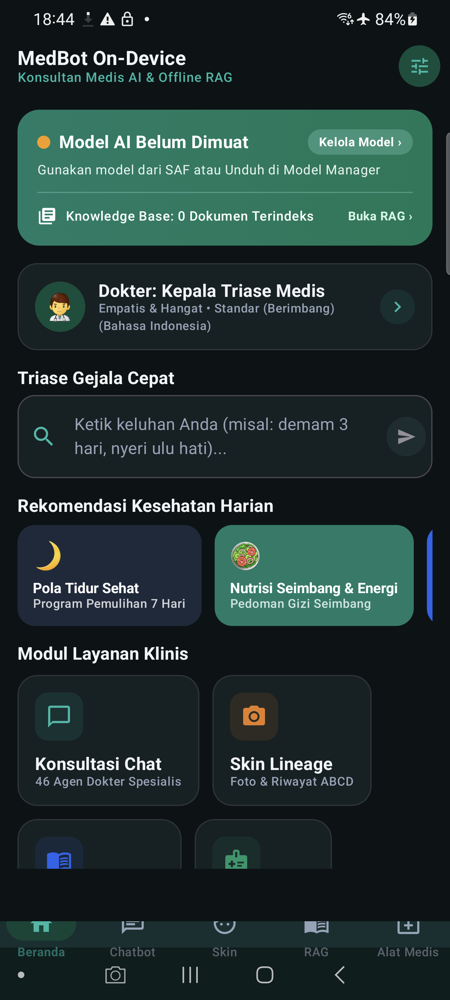

# 🩺 MedBot: On-Device Medical AI Companion & Clinical RAG

<p align="center">
  
</p>

> **100% Offline & Private On-Device Medical Multi-Agent System powered by Gemma LLM, Storage Access Framework (SAF), Deterministic Clinical Tools, and RAG Knowledge Retrieval.**

<p align="center">
  
</p>

---

## 🌟 Fitur Utama (Core Features)

1. **46 Agen Dokter Spesialis On-Device**:
   - Triase cerdas (*Triage Orchestrator*) & *Query Rewriter* multi-turn.
   - Personalisasi persona (*Empathetic, Clinical, Concise, Educational*) & kedalaman analisis.
   - Dukungan dwibahasa: Bahasa Indonesia 🇮🇩 & English 🇬🇧.
2. **Kaidah ABCD & Linimasa Kulit (Skin Lineage)**:
   - Analisis morfologi lesi (*Asymmetry, Border, Color, Diameter*) & split before/after comparator slider.
3. **Perkakas Medis Deterministik (Local Tools)**:
   - WHO Z-Score Balita & Stunting, Dosis Sirup Anak mg/kgBB, Rumus Naegele HPL Kehamilan, Kalkulator BMI & BMR Dewasa, Interpretasi Nilai Rujukan Lab, dan Database Interaksi Obat.
4. **Offline RAG Knowledge Retrieval**:
   - Parser multi-format bawaan untuk dokumen pedoman klinis Kemenkes/WHO (`.pdf`, `.txt`, `.md`) via Android Storage Access Framework (SAF).

---

| Gate | Status | Evidence boundary |
| --- | --- | --- |
| Source and test contracts | PASS | Pure Kotlin tests cover registry, triage, parser, chunker, state, and validation-shaped failure paths. |
| Lint, unit test, debug assembly | BLOCKED | Current local run stops at `:app:kspDebugKotlin` with `unexpected jvm signature V`; offline mode also lacks the Kotlin Gradle plugin cache. |
| Compose/instrumentation asset | UNAVAILABLE | Test-only Compose gate renders `BLOCKED` when no real model, document, or photo is supplied. No device run is claimed. |
| Real model load/inference | BLOCKED | No verified model bundle is supplied or checksum-validated here. |
| Real document ingestion/RAG | BLOCKED | No user-selected document was supplied or ingested on a device. |
| Real photo/skin analysis | BLOCKED | No user-selected photo, vision model, or clinical validation run is supplied. |
| Physical preview screenshot | UNAVAILABLE | No fresh physical screenshot is available. The root `medbot_live_preview.png` is not used as new evidence. |

`PASS` means only that the stated repository contract is represented by source or tests. It never means model, device, or clinical success. See [docs/traceability.md](docs/traceability.md).

## Local-only boundary

Intended clinical processing is local to the device. Internet access is limited to optional model acquisition in the product design. This slice performs no network call, sends no medical data, and adds no telemetry. External model URLs in the existing registry are references, not verified availability or integrity evidence.

The application is decision support, not an autonomous doctor. It must not be used as a diagnosis, treatment, prescription, or emergency-response substitute. Seek qualified medical care for urgent symptoms.

## Verification assets

- Unit tests: `app/src/test` use small in-test fixtures only. They do not prove a real model or device result.
- Instrumentation: `app/src/androidTest` contains a Compose-only evidence gate. Missing real inputs render `Evidence gate: BLOCKED`.
- Journey specification: [docs/e2e/journeys/medbot_evidence_gate.xml](docs/e2e/journeys/medbot_evidence_gate.xml). It is not an executed report.
- Traceability: [docs/traceability.md](docs/traceability.md).

## Build and test commands

Windows PowerShell:

```powershell
.\gradlew.bat lintDebug --no-daemon
.\gradlew.bat testDebugUnitTest --no-daemon
.\gradlew.bat assembleDebug --no-daemon
```

With an identified emulator or physical device:

```powershell
adb devices -l
.\gradlew.bat connectedDebugAndroidTest --no-daemon
```

The connected test command requires a real device/emulator. An empty `adb devices -l` result is `BLOCKED`, not acceptance.

## Current limitations

- No real Gemma/LiteRT model bundle is checked in or validated.
- No physical device/API/OEM run, model checksum result, offline-mode run, or fresh screenshot is available.
- Current production behavior still needs a separate remediation slice for fail-closed model/photo handling and checksum-backed download verification; this request intentionally does not edit production Kotlin, Gradle, or manifest files.
- The current local build is blocked before unit execution by KSP: `unexpected jvm signature V`.
- The existing `SendMessageUseCaseTest` is marked ignored because it reaches a deterministic fallback without a supplied real model; it is not model evidence.

## Future physical preview path

When a fresh run is available, store the captured artifact at `docs/e2e/preview/physical-preview-YYYY-MM-DD.png` with device/API/OEM and command evidence. Until then, leave that path absent and keep preview status `UNAVAILABLE`.
